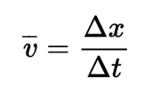
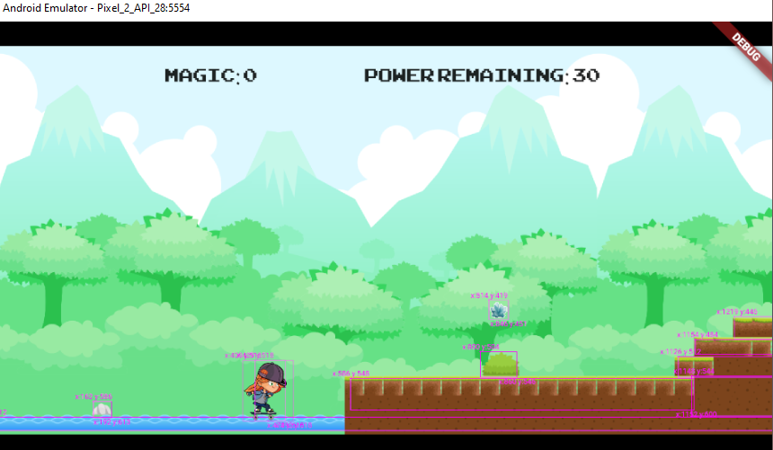
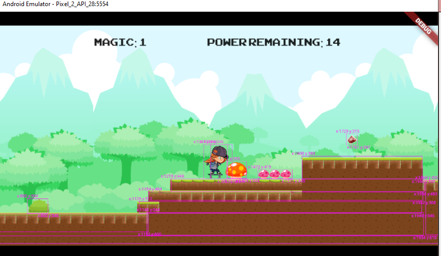
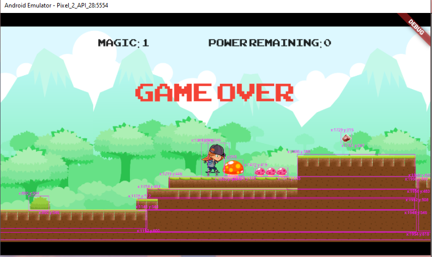

# Leena Game

[Web Page](https://caitlynbakery.github.io/leena_game/)
View Link!

In this project, I learned how to use bounding detection with CollisionCallbacks and
using sprites from a tilesheet. The main point I learned was how to use gravity and velocity to make Leena move. Below, is the main algorithm for the velocity.

```dart
  @override
  void update(double dt) {
    super.update(dt);
    if (!leena.onGround) {
      velocity.y += gravity;
    }
    leena.position += velocity * dt;
  }
```

The velocity is accelerated with a gravity constant which makes Leena move faster to the ground. We can explain this equation since `dt` is ∆t which corresponds to the formula
∆distance = velocity * ∆time.



## How to Play

Press on sides of screen to change Leena's horizontal velocity. Tap on the top to make Leena jump! The objective is to collect all gems before power remaining runs out.

## Leena Start



When we start the game, Leena has full power (30 seconds) which continously decrements as the game updates. Leena uses a SpriteAnimationComponent to cycle through
her skating tricks.

## Leena Obstacles



Leena encounters obstacles, such as cute mushrooms, which are a part of the tile map.

## Game Over



The game ends when the power remaining reaches 0. Leena's movement stops!
